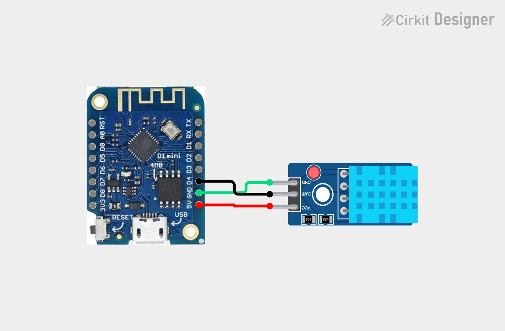

# LittleFS Sensor Data Writer and Server

This project uses a ESP8266 WeMos D1 mini board to read DHT11 sensor temperature and humidity values and write them to a data.csv file using LittleFS library.

## Prerequisites
- Platformio 
- ESP8266 WeMos D1 mini board
- DHT11 sensor

## Tech Stack

**Code:** C++

**Electronics:** 
- Development board WeMos D1 mini clone
- DHT11 temperature and humidity sensor

## Circuit schematic


Pinout Reference

DHT11 Data Pin → D4

DHT11 VCC → 5V

DHT11 GND → GND

## How to Use:
1. Clone the project

```bash
  git clone https://github.com/localhost-5555/-LittleFS-Sensor-Data-Writer-and-Server.git
```

2. Follow the circuit schematic to do the wiring.

3. Configure secret variables

Navigate to the include folder:

```bash
  cd include
```

Rename:

```bash
  mv secrets_example.h secret.h
```

Edit secrets.h and add your WiFi credentials:

```bash
  #define SECRET_SSID "MySSID"		// replace MySSID with your WiFi network name
  #define SECRET_PASS "MyPassword"	// replace MyPassword with your WiFi password
```


4. Upload the sketch

- Open the project in PlatformIO
- Connect the WeMos D1 mini via USB cable
- Click Upload (or run platformio run --target upload in terminal)
- Once upload completes, open the Serial Monitor (115200 baud) to verify the sketch is running

**Usage**

After a successful upload, the device will:

- Connect to your WiFi network
- Initialize the LittleFS file system
- Begin reading temperature and humidity from the DHT11 sensor every 60 seconds
- Write the readings to data.csv in LittleFS

```bash
  ............
  WiFi connected
  Waiting for NTP time...
  .
  LittleFS mounted
  DHT11 sensor initialized
  Custom fs library
  Message appended
  Logged: 21.1,94.0,2025-12-28 01:48:32
  Reading file: /data.csv
  Read from file: Temperature(C),Humidity(%),Timestamp
  14.8,91.0,2025-12-27 17:34:03
  16.3,92.0,2025-12-27 17:35:03
  16.3,90.0,2025-12-27 17:36:03
  16.3,90.0,2025-12-27 17:37:03
```

**Data Format**

The CSV file stored in LittleFS contains the following columns:

```bash
  Temperature(C),Humidity(%),Timestamp
  14.8,91.0,2025-12-27 17:34:03
  16.3,92.0,2025-12-27 17:35:03
  16.3,90.0,2025-12-27 17:36:03
  16.3,90.0,2025-12-27 17:37:03
```

## Troubleshooting
Issue: "Failed to connect to WiFi"

- Verify SSID and password in secrets.h are correct
- Ensure your WiFi network is accessible

Issue: "DHT sensor not responding"

- Verify wiring matches the circuit diagram
- Ensure the DHT11 data pin is connected to GPIO D4
- Try replacing the sensor (they can be faulty)


Issue: "LittleFS initialization failed"

- The file system may be corrupted; try erasing the flash via PlatformIO
- Run: platformio run --target erase

Issue: No output in Serial Monitor

- Verify USB cable is properly connected
- Check that the correct board and COM port are selected in PlatformIO
- Try a different USB cable (some cables are charging-only)

## Future Enhancements

Web interface for data viewing and download.
